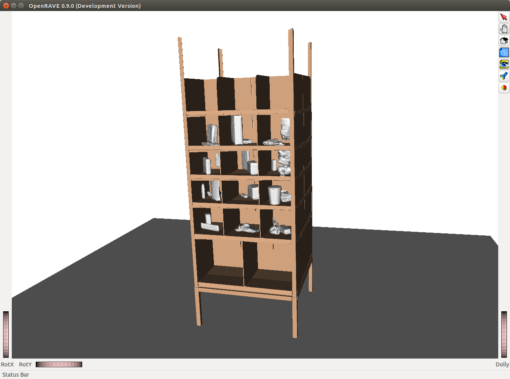

# OpenRAVE Amazon Picking Challenge Environment

A collection of Amazon Picking Challenge (APC) objects/products and the "Kiva Pod" (i.e the shelf used in the competition) for OpenRAVE. 

A Python script is also provided to create a simple randomise environment. Due to time constraints, the script is a quick solution of placing objects to different locations on the shelf, however is not perfect. Feel free to contribute and improve the code.

The script also provide a functionality to export a randomise environment to a static XML file.

# References
- **Objects/Products KinBodies:** Thanks to *Arjun Singh, Karthik Narayan, Ben Kehoe, Sachin Patil, Ken Goldberg* and *Pieter Abbeel* from the *Robot Learning Lab, UC Berkeley*: [http://rll.berkeley.edu/amazon_picking_challenge/](http://rll.berkeley.edu/amazon_picking_challenge/).
- **Kiva Pod (Shelf):** Thanks to [http://pwurman.org/amazonpickingchallenge/2015/gazebo_pod.shtml?](http://pwurman.org/amazonpickingchallenge/2015/gazebo_pod.shtml?).

# Contributors
This work was developed by the Robotics Lab in the School of Computing at the University of Leeds. This work is initially developed and maintained by [Rafael Papallas](https://github.com/papallas).
